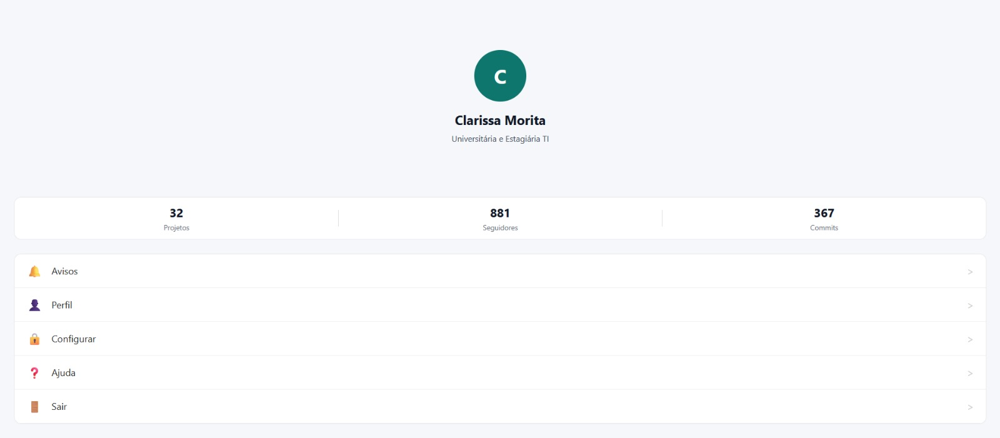

# DS151 - Aula 05 - Layout Básico

Clone o projeto e execute o seguinte:

```
npm ci
npx expo start
```

## Versao Web

Comandos utilizados para instalar as dependencias e rodar no navegador:

```bash
npm install
npx expo start --web
```

Preview da versao web:



Este repositório já contem a biblioteca `react-native-safe-area-context`. Ela foi instalada com o seguinte comando (não é necessário executar):

```
npx expo install react-native-safe-area-context
```
